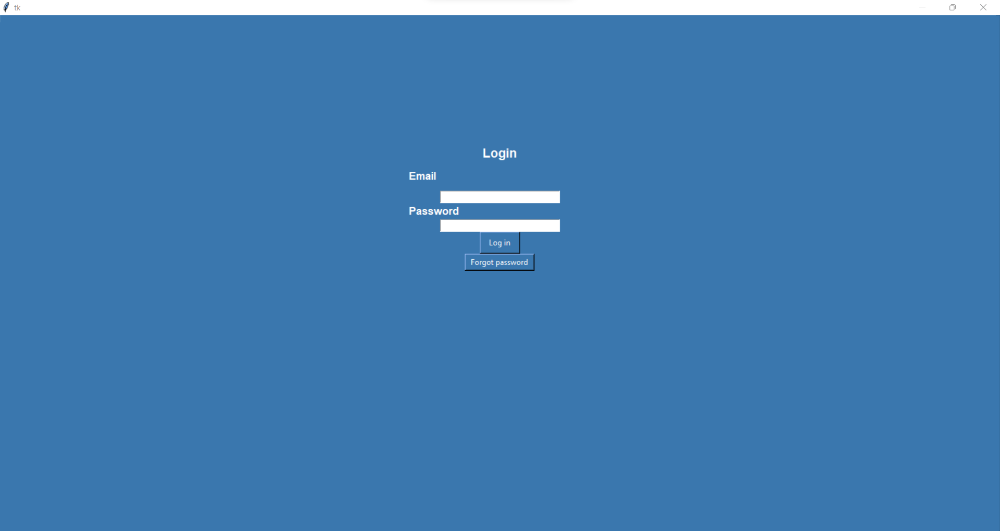
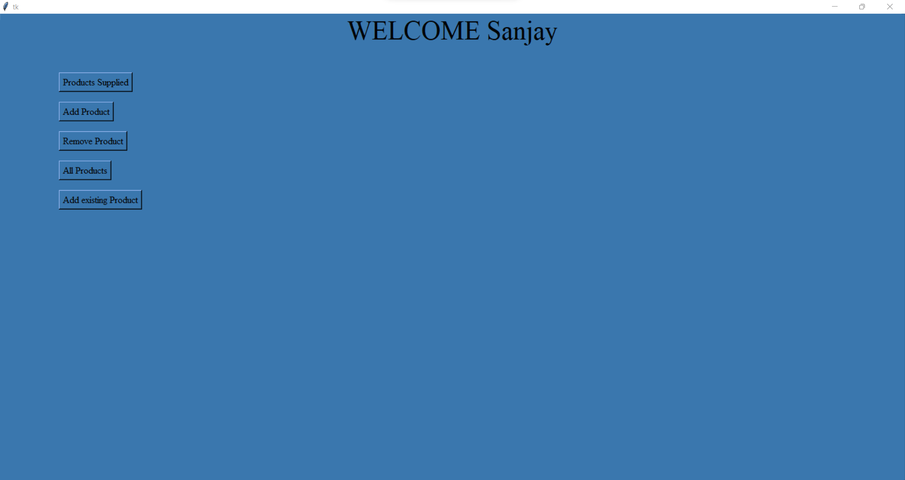
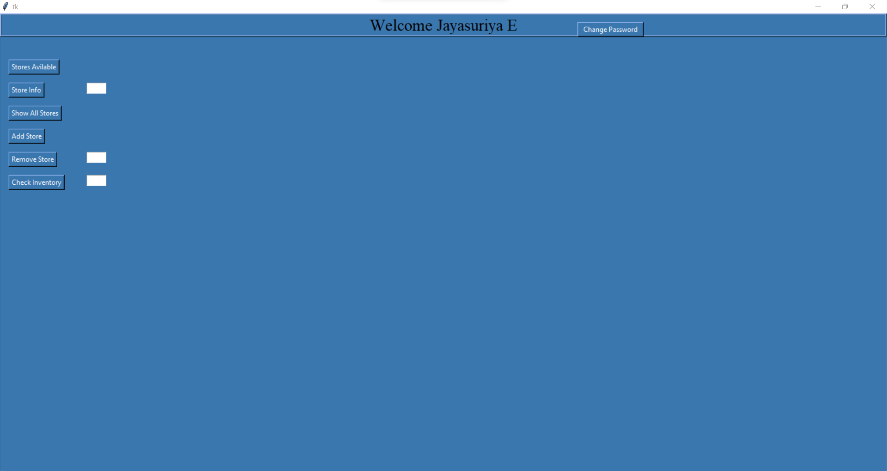
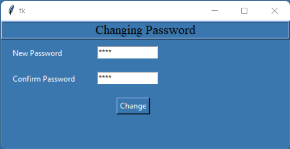

# SARAK
SARAK is a simple Inventory management system. It uses MySQL for database and Python for UI creation. It can be used by both Store Owners and Product suppliers for monitoring and supplying products.

# DBMS

To create the Database, run the INVENTORY FINAL.sql file.

# Usage

This management system can be used for finding new suppliers of a product, new products, for a store owner. A supplier can list down new products which they are willing to sell. This is also enables the store owner to manage his different stores in a single interface, and manage its stock updation and reorder based on its need.

# How to use

To use the system, run the login.py file.

# Screenshots

## Login screen

## Supplier Login

## Store Owner Login

## SMTP For Changing Forgotten Password

## Password Change

